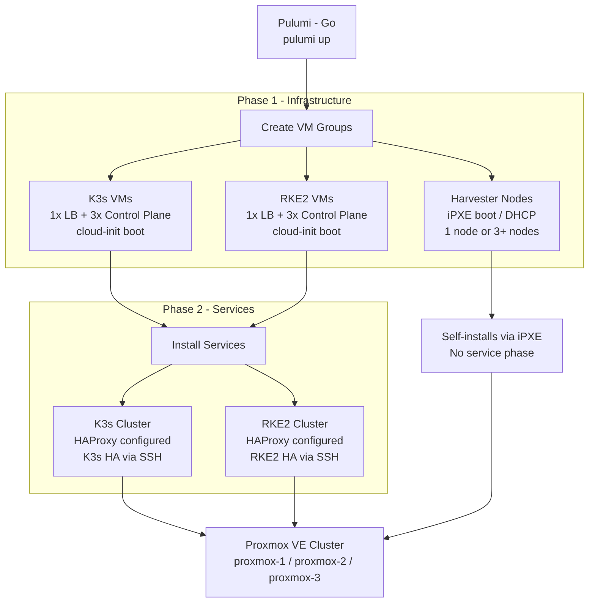

<div align="center">
  
</div>

<div align="center">

[](https://golang.org)
[](https://pulumi.com)
[](https://pve.proxmox.com)
[](LICENSE)
[](https://github.com/rajeshkio/pulumiInfraProxmox/stargazers)
[](https://github.com/rajeshkio/pulumiInfraProxmox/forks)
[](https://github.com/rajeshkio/pulumiInfraProxmox/commits/main)

</div>

---

A service-oriented infrastructure deployment system for Proxmox VE, built with Pulumi and Go. Deploy independent, high-availability Kubernetes clusters (K3s, RKE2) and Harvester HCI using a two-phase architecture that separates VM provisioning from service installation. Each service uses dedicated VM templates to ensure complete lifecycle isolation.

## Table of Contents

- [Architecture](#architecture)
- [Project Structure](#project-structure)
- [Prerequisites](#prerequisites)
- [Quick Start](#quick-start)
- [Configuration](#configuration)
- [Available Services](#available-services)
- [Template Strategy](#template-strategy)
- [Boot Methods](#boot-methods)
- [Deployment Examples](#deployment-examples)
- [Outputs](#outputs)
- [Troubleshooting](#troubleshooting)
- [Resource Requirements](#resource-requirements)
- [Contributing](#contributing)
- [License](#license)

## Architecture



### Two-Phase Deployment

Deployment runs in two sequential phases within a single `pulumi up`:

**Phase 1 - Infrastructure:** Creates all VM groups from Proxmox templates. VMs are cloned sequentially per template per Proxmox node to prevent NFS lock contention. VM groups with `count: 0` are skipped silently.

**Phase 2 - Services:** Installs and configures software on the provisioned VMs via SSH. Services discover their target VMs by name from the config. Each enabled service gets its own HAProxy load balancer with dynamically built backends.

### Dependency Isolation

Each service uses its own dedicated Proxmox templates. This means:

- Destroying K3s VMs has zero effect on RKE2 or Harvester
- Sequential cloning is scoped per template per node, so K3s and RKE2 clone in parallel from different templates
- Load balancers are never shared between services

## Project Structure

```
pulumiInfraProxmox/
|-- main.go           # Pulumi entrypoint, orchestrates two-phase deployment
|-- types.go          # Data structures: VM, Services, ServiceConfig, HAProxy
|-- handlers.go       # Service handlers for K3s, RKE2, and HAProxy
|-- executers.go      # Service execution engine and dispatch
|-- vm_creation.go    # VM provisioning via cloud-init and iPXE boot
|-- utils.go          # Config loading, validation, Proxmox provider setup
|-- go.mod            # Go module dependencies
|-- Pulumi.yaml       # Pulumi project configuration
|-- Pulumi.dev.yaml   # Stack configuration (VMs and services)
|-- .env.example      # Environment variable reference
|-- argocd/           # ArgoCD ApplicationSet manifests
|-- cmd/
|   |-- ipxe-gen/     # iPXE ISO generator for Harvester
|-- docs/
    |-- banner.svg
    |-- architecture.svg
```

## Prerequisites

- [Go 1.25+](https://golang.org/dl/)
- [Pulumi CLI](https://www.pulumi.com/docs/install/)
- A Proxmox VE cluster with at least one node
- A Proxmox API token with VM creation permissions
- SSH key access to Proxmox nodes (used for VM provisioning)
- VM templates prepared on shared/NFS storage (see [Template Strategy](#template-strategy))

## Quick Start

**Step 1: Clone the repository**

```bash
git clone https://github.com/rajeshkio/pulumiInfraProxmox.git
cd pulumiInfraProxmox
```

**Step 2: Install Go dependencies**

```bash
go mod download
```

**Step 3: Create a Pulumi stack**

```bash
pulumi stack init dev
```

**Step 4: Export required environment variables**

```bash
# Proxmox API connection (picked up automatically by the provider)
export PROXMOX_VE_ENDPOINT="https://your-proxmox:8006/api2/json"
export PROXMOX_VE_API_TOKEN="user@pam!token-name=xxxxxxxx-xxxx-xxxx-xxxx-xxxxxxxxxxxx"

# SSH access to Proxmox nodes (used during VM provisioning)
export PROXMOX_VE_SSH_USERNAME="root"
export PROXMOX_VE_SSH_PRIVATE_KEY="$(cat ~/.ssh/id_rsa)"

# Public key injected into VMs via cloud-init
export SSH_PUBLIC_KEY="$(cat ~/.ssh/id_rsa.pub)"
```

> [!NOTE]
> The Proxmox API token format is `user@realm!token-name=uuid`. You can create one in the Proxmox UI under Datacenter > Permissions > API Tokens.

**Step 5: Set the VM password**

This password is injected into VMs via cloud-init and stored encrypted in your stack config:

```bash
pulumi config set password your-vm-password --secret
```

**Step 6: Configure your stack**

Edit `Pulumi.dev.yaml` with your node names, template IDs, IP addresses, and which services to enable. See [Configuration](#configuration) for a full reference.

**Step 7: Deploy**

```bash
pulumi up
```

## Configuration

### Required Environment Variables

| Variable | Description |
|---|---|
| `PROXMOX_VE_ENDPOINT` | Proxmox API URL, e.g. `https://192.168.1.100:8006/api2/json` |
| `PROXMOX_VE_API_TOKEN` | API token in format `user@pam!token-name=uuid` |
| `PROXMOX_VE_SSH_USERNAME` | SSH username for connecting to Proxmox nodes |
| `PROXMOX_VE_SSH_PRIVATE_KEY` | Private key content for Proxmox SSH access |
| `SSH_PUBLIC_KEY` | Public key injected into VMs via cloud-init |

### VM Creation Tuning

```yaml
proxmoxInfra:vmCreation:
  maxRetries: 5    # Retry attempts per VM on clone failure (default: 5)
  batchSize: 3     # VMs created in parallel within a batch (default: 3)
  batchDelay: 10   # Seconds to wait between batches (default: 10)
```

### VM Definition Fields

| Field | Required | Default | Description |
|---|---|---|---|
| `name` | Yes | - | VM group name, used for service discovery |
| `count` | Yes | - | Number of VMs to create. Set to `0` to skip |
| `templateId` | Yes* | - | Proxmox template VM ID. Required for cloud-init VMs |
| `cpu` | Yes | - | vCPU count |
| `memory` | Yes | - | RAM in MB |
| `diskSize` | Yes | - | Disk size in GB |
| `ips` | Yes* | - | Static IP list. Required for cloud-init VMs |
| `proxmoxNode` | No | `proxmox-3` | Target Proxmox node name |
| `username` | No | `rajeshk` | OS user created via cloud-init |
| `authMethod` | No | `ssh-key` | Authentication method: `ssh-key` or `password` |
| `bootMethod` | No | `cloud-init` | Boot method: `cloud-init` or `ipxe` |
| `ipxeConfig` | Yes* | - | Required when `bootMethod` is `ipxe` |

### Full Stack Configuration Reference (Pulumi.dev.yaml)

```yaml
config:
  proxmoxInfra:gateway: "192.168.1.1"

  proxmoxInfra:vmCreation:
    maxRetries: 5
    batchSize: 3
    batchDelay: 10

  proxmoxInfra:vms:

    # K3s Load Balancer
    - name: "k3s-lb"
      count: 1
      templateId: 9000        # Ubuntu template with HAProxy installed
      cpu: 2
      memory: 2048
      diskSize: 50
      username: youruser
      authMethod: ssh-key
      proxmoxNode: proxmox-1
      bootMethod: cloud-init
      ips: ["192.168.1.200"]

    # K3s Control Plane (3 nodes for HA)
    - name: "k3s-servers"
      count: 3
      templateId: 9001        # SLE Micro or Ubuntu template
      cpu: 4
      memory: 4096
      diskSize: 50
      username: youruser
      authMethod: ssh-key
      proxmoxNode: proxmox-1
      bootMethod: cloud-init
      ips: ["192.168.1.180", "192.168.1.181", "192.168.1.182"]

    # K3s Workers (set count: 0 to disable)
    - name: "k3s-workers"
      count: 0
      templateId: 9001
      cpu: 4
      memory: 8192
      diskSize: 100
      username: youruser
      authMethod: ssh-key
      proxmoxNode: proxmox-1
      bootMethod: cloud-init
      ips: ["192.168.1.190", "192.168.1.191"]

    # RKE2 Load Balancer (use a separate template from K3s LB)
    - name: "rke2-lb"
      count: 1
      templateId: 9002
      cpu: 2
      memory: 2048
      diskSize: 50
      username: youruser
      authMethod: ssh-key
      proxmoxNode: proxmox-2
      bootMethod: cloud-init
      ips: ["192.168.1.201"]

    # RKE2 Control Plane (use a separate template from K3s servers)
    - name: "rke2-servers"
      count: 3
      templateId: 9003
      cpu: 4
      memory: 4096
      diskSize: 50
      username: youruser
      authMethod: ssh-key
      proxmoxNode: proxmox-2
      bootMethod: cloud-init
      ips: ["192.168.1.210", "192.168.1.211", "192.168.1.212"]

    # Harvester (single node or 3+ nodes for HA, never 2)
    - name: "harvester-nodes"
      count: 1
      bootMethod: ipxe
      ipxeConfig:
        isoFiles:
          - "harvester-boot-v1.5.2.iso"   # Single ISO for single node
      memory: 40960
      cpu: 12
      diskSize: 300

  proxmoxInfra:services:
    k3s:
      enabled: true
      loadBalancer: ["k3s-lb"]
      controlPlane: ["k3s-servers"]
      workers: ["k3s-workers"]
      config:
        cluster-init: true
        tls-san-loadbalancer: true
        ports:
          - name: api
            frontend: 6443
            backend: 6443

    rke2:
      enabled: false
      loadBalancer: ["rke2-lb"]
      controlPlane: ["rke2-servers"]
      workers: []
      config:
        cluster-init: true
        ports:
          - name: api
            frontend: 6443
            backend: 6443
          - name: supervisor
            frontend: 9345
            backend: 9345

    kubeadm:
      enabled: false   # Not yet implemented

    talos:
      enabled: false   # Not yet implemented
```

> [!NOTE]
> The `proxmoxInfra:password` key is added automatically when you run `pulumi config set password ... --secret`. Do not add it manually.

## Available Services

| Service | Status | Description |
|---|---|---|
| `k3s` | Stable | Lightweight HA Kubernetes. Installs via SSH with HAProxy load balancer |
| `rke2` | Stable | Production-grade HA Kubernetes. Installs via SSH with HAProxy load balancer |
| `kubeadm` | Not implemented | Planned. Config keys are accepted but do nothing |
| `talos` | Not implemented | Planned. Config keys are accepted but do nothing |
| Harvester | Stable | HCI platform. Boots via iPXE, no service phase needed |

## Template Strategy

Each service must use its own dedicated Proxmox templates. This is what enables independent lifecycle management: cloning VMs for K3s and RKE2 happens in parallel because they use different template IDs.

> [!IMPORTANT]
> Never share a template between two services. If K3s and RKE2 share template 9001, destroying one service's VMs can block the other from cloning.

The table below shows recommended template ID conventions. The IDs are user-defined and must match what you have on your Proxmox cluster.

| Service | Component | Suggested Template ID | Base OS |
|---|---|---|---|
| K3s | Load Balancer | 9000 | Ubuntu with HAProxy |
| K3s | Control Plane + Workers | 9001 | SLE Micro or Ubuntu |
| RKE2 | Load Balancer | 9002 | Ubuntu with HAProxy |
| RKE2 | Control Plane + Workers | 9003 | SLE Micro or Ubuntu |
| Kubeadm | Load Balancer | 9004 | Ubuntu |
| Kubeadm | Control Plane + Workers | 9005 | Ubuntu |

### Template Requirements

Before using a template:

1. The template must NOT have a cloud-init disk pre-configured (Pulumi creates it dynamically)
2. `qemu-guest-agent` must be installed and enabled inside the template VM
3. Templates should be stored on shared/NFS storage accessible from all Proxmox nodes

```bash
# Example: prepare a template on Proxmox
qm clone <base-vm-id> 9000 --full --name ubuntu-lb-template
qm set 9000 --delete ide2          # remove any existing cloud-init disk
# boot the VM, install qemu-guest-agent, shut it down
qm set 9000 --template 1

# Verify no orphaned cloud-init file remains
ls /mnt/pve/nas-storage/images/9000/
# Output should NOT include vm-9000-cloudinit.qcow2
```

## Boot Methods

### Cloud-Init (default)

Used for all standard VM types (K3s, RKE2, Kubeadm nodes).

- Requires `qemu-guest-agent` installed in the template
- Template must have no pre-existing cloud-init disk
- Supports static IP assignment via the `ips` field
- SSH key or password authentication configured on first boot

### iPXE Boot

Used exclusively for Harvester HCI nodes.

- VMs boot from ISO files served over the network
- Network configuration is DHCP only (no static IPs)
- No `templateId` required

**Harvester node count rules:**

| Count | ISO files needed | Notes |
|---|---|---|
| 1 | 1 ISO | Single node, no HA |
| 2 | Not supported | Breaks etcd quorum. Pulumi will error |
| 3+ | 2 ISOs (create + join) | HA cluster. ISO names must contain `create` and `join` |

```yaml
# Single node Harvester
- name: "harvester-nodes"
  count: 1
  bootMethod: ipxe
  ipxeConfig:
    isoFiles:
      - "harvester-boot-v1.5.2.iso"

# HA Harvester (3 nodes)
- name: "harvester-nodes"
  count: 3
  bootMethod: ipxe
  ipxeConfig:
    isoFiles:
      - "harvester-create-v1.5.2.iso"
      - "harvester-join-v1.5.2.iso"
```

## Deployment Examples

### K3s Only

```yaml
proxmoxInfra:services:
  k3s:
    enabled: true
  rke2:
    enabled: false
```

### RKE2 Only

```yaml
proxmoxInfra:services:
  k3s:
    enabled: false
  rke2:
    enabled: true
```

### K3s and RKE2 Together

Both clusters deploy in parallel during Phase 1 (VM creation) because they use separate templates. Phase 2 installs each cluster independently.

```yaml
proxmoxInfra:services:
  k3s:
    enabled: true
  rke2:
    enabled: true
```

### Disable a VM Group

Set `count: 0` on any VM group to skip it without removing it from config:

```yaml
- name: "k3s-workers"
  count: 0    # skipped during deployment
```

### Selective Destroy

Destroy a single service without touching others by targeting its load balancer URN:

```bash
# Destroy only K3s (RKE2 and Harvester remain intact)
pulumi destroy \
  --target urn:pulumi:dev::proxmoxInfra::proxmoxve:VM/virtualMachine:VirtualMachine::k3s-lb-0 \
  --target-dependents

# Destroy only RKE2
pulumi destroy \
  --target urn:pulumi:dev::proxmoxInfra::proxmoxve:VM/virtualMachine:VirtualMachine::rke2-lb-0 \
  --target-dependents
```

## Outputs

After `pulumi up`, the following stack outputs are exported:

```bash
pulumi stack output
```

```
Outputs:
  k3s-lb-count:       1
  k3s-lb-ips:         ["192.168.1.200"]
  k3s-servers-count:  3
  k3s-servers-ips:    ["192.168.1.180","192.168.1.181","192.168.1.182"]
  k3s-workers-count:  2
  k3s-workers-ips:    ["192.168.1.190","192.168.1.191"]

  rke2-lb-count:      1
  rke2-lb-ips:        ["192.168.1.201"]
  rke2-servers-count: 3
  rke2-servers-ips:   ["192.168.1.210","192.168.1.211","192.168.1.212"]

  harvester-nodes-count:        1
  harvester-nodes-ip-assignment: DHCP

  totalVMsCreated: 11
```

## Troubleshooting

### Cloud-Init Disk Conflict

**Error:** `disk image already exists`

A previous run left an orphaned cloud-init disk in the template's image directory.

```bash
# Identify and remove it
ls /mnt/pve/nas-storage/images/9000/
rm /mnt/pve/nas-storage/images/9000/vm-9000-cloudinit.qcow2

# Confirm the template has no cloud-init config
qm config 9000 | grep ide
# Should return nothing
```

### Pulumi Stuck at "Updating"

**Cause:** `qemu-guest-agent` is not running inside the VM. Pulumi waits for the agent to respond before marking the VM as ready.

```bash
# Temporarily un-template it, boot, install the agent, re-template
qm set 9000 --template 0
qm start 9000
ssh youruser@<template-ip> "sudo systemctl enable --now qemu-guest-agent"
qm shutdown 9000
qm set 9000 --template 1
```

### VM Clone Fails with NFS Lock Error

Sequential cloning is enforced per template per Proxmox node, which handles this in most cases. If you still see NFS lock errors, reduce the batch size:

```yaml
proxmoxInfra:vmCreation:
  batchSize: 1
  batchDelay: 15
```

### Wrong Environment Variables

If `pulumi up` fails immediately with a missing variable error, check you have exported all five required variables. A common mistake is using `PROXMOX_VE_PASSWORD` (wrong) instead of `PROXMOX_VE_API_TOKEN` (correct), or `PROXMOX_VE_USERNAME` instead of `PROXMOX_VE_SSH_USERNAME`.

```bash
# Verify all five are set
echo $PROXMOX_VE_ENDPOINT
echo $PROXMOX_VE_API_TOKEN
echo $PROXMOX_VE_SSH_USERNAME
echo $PROXMOX_VE_SSH_PRIVATE_KEY | head -1
echo $SSH_PUBLIC_KEY | head -1
```

### Check Cross-Service Dependencies

Services should be fully isolated. Verify no K3s VM depends on an RKE2 VM:

```bash
pulumi stack export | \
  jq '.deployment.resources[] | select(.type == "proxmoxve:VM/virtualMachine:VirtualMachine") | {id, dependencies}'
```

## Resource Requirements

These are baseline recommendations. Adjust based on your workloads.

| Component | CPU | Memory | Disk | Network | Template |
|---|---|---|---|---|---|
| K3s Load Balancer | 2 | 2 GB | 50 GB | Static IP | Dedicated (e.g. 9000) |
| K3s Control Plane | 4+ | 4+ GB | 50+ GB | Static IP | Dedicated (e.g. 9001) |
| K3s Worker | 4+ | 8+ GB | 100+ GB | Static IP | Dedicated (e.g. 9001) |
| RKE2 Load Balancer | 2 | 2 GB | 50 GB | Static IP | Dedicated (e.g. 9002) |
| RKE2 Control Plane | 4+ | 4+ GB | 50+ GB | Static IP | Dedicated (e.g. 9003) |
| RKE2 Worker | 4+ | 8+ GB | 100+ GB | Static IP | Dedicated (e.g. 9003) |
| Harvester Node | 12+ | 32+ GB | 300+ GB | DHCP | None (iPXE) |

## Contributing

1. Fork the repository
2. Create a feature branch: `git checkout -b feature/new-service`
3. Add a service handler in `handlers.go`
4. Register the handler in the `serviceHandlers` map
5. Add the service struct to `types.go` if needed
6. Create a dedicated template convention for the new service
7. Test isolated deployment and selective destruction
8. Submit a PR with a working example in `Pulumi.dev.yaml`

### Adding a New Service

Each service handler must implement the `ServiceHandler` function signature:

```go
func myServiceHandler(ctx *pulumi.Context, serviceCtx ServiceContext) error {
    // serviceCtx.VMs       - provisioned VMs
    // serviceCtx.IPs       - their IP addresses
    // serviceCtx.Config    - service-specific config from Pulumi.dev.yaml
    // serviceCtx.GlobalDeps - shared VM group references
    return nil
}
```

Register it alongside the existing handlers in `handlers.go`.

## License

MIT License. See [LICENSE](LICENSE) for details.

## Resources

- [Pulumi Documentation](https://www.pulumi.com/docs/)
- [Proxmox VE API](https://pve.proxmox.com/wiki/Proxmox_VE_API)
- [pulumi-proxmoxve Provider](https://github.com/muhlba91/pulumi-proxmoxve)
- [K3s Documentation](https://docs.k3s.io/)
- [RKE2 Documentation](https://docs.rke2.io/)
- [Harvester Documentation](https://docs.harvesterhci.io/)
- [HAProxy Documentation](https://www.haproxy.org/)
